# FlightRisk NYC
### Predicting arrival delay before the aircraft moves

**Datathon technical report — NYC Flights 2013**

---

## 1. The problem, and why the usual version of it is too easy

An airline operations desk wants to know, at the moment a flight is scheduled
to depart, whether it will land more than fifteen minutes late. Fifteen minutes
is not an arbitrary cutoff: it is the US Bureau of Transportation Statistics
definition of an on-time arrival, so it is the number airlines are measured on
and the number that decides whether a connection holds.

The prediction is only worth anything if it arrives before the decisions do.
Once the aircraft has pushed back, the crew is committed, the gate is
reassigned, and the passenger with a 55-minute connection is already airborne.
So we fix the decision point at the **scheduled departure time, before
push-back**, and allow the model nothing that is determined after it.

That constraint is the whole project, because it is the one most published
treatments of this dataset drop. `dep_delay` — how many minutes late the
aircraft actually left — is sitting in the flights table, correlates with
arrival delay at ρ ≈ 0.9, and turns the problem into near-arithmetic. A model
using it scores ROC-AUC above 0.90 and is operationally worthless, because by
the time you know `dep_delay` you no longer need a prediction.

We did not simply exclude it. We trained both models and measured the gap,
which turns out to be the most informative single number in the study:

| Decision point | PR-AUC | ROC-AUC |
|---|---|---|
| Pre-push-back (deployable) | 0.507 | 0.716 |
| Post-push-back (adds `dep_delay`) | 0.846 | 0.903 |

Two thirds of the apparent skill of a "flight delay model" is the observation
that the plane left late. What remains — the 0.507 — is the part that is
genuinely forecastable in advance, and it is the subject of this report.

---

## 2. Data

**Source.** NYC Flights 2013, available on Kaggle at
<https://www.kaggle.com/datasets/aephidayatuloh/nyc-flights-2013> and
canonically as the `nycflights13` R package
(<https://github.com/tidyverse/nycflights13>). Five tables, all tracing back to
US Bureau of Transportation Statistics on-time records, the FAA aircraft
registry, and ASOS/NOAA hourly weather observations.

| Table | Rows | Role |
|---|---:|---|
| `flights` | 336,776 | one row per departure from EWR, JFK or LGA in 2013 |
| `weather` | 26,115 | hourly observations at the three origin airports |
| `planes` | 3,322 | aircraft registry keyed on tail number |
| `airports` | 1,458 | coordinates, elevation, timezone |
| `airlines` | 16 | carrier code to name |

**Labelling.** 9,430 flights (2.8%) have no arrival delay because they were
cancelled or diverted. They cannot carry an "arrived late" label and were
removed, leaving **327,346 labelled flights**, of which **23.7% are late**.

This is a real limitation and we flag it rather than bury it. Cancellations are
the most disruptive outcome of all, and they are not randomly distributed —
they cluster in exactly the storm-and-holiday conditions the model is supposed
to warn about. Dropping them understates operational disruption and makes the
December test period look milder than it was. A production system should model
this as three outcomes (on time / late / cancelled), not two.

### 2.1 What the data looks like

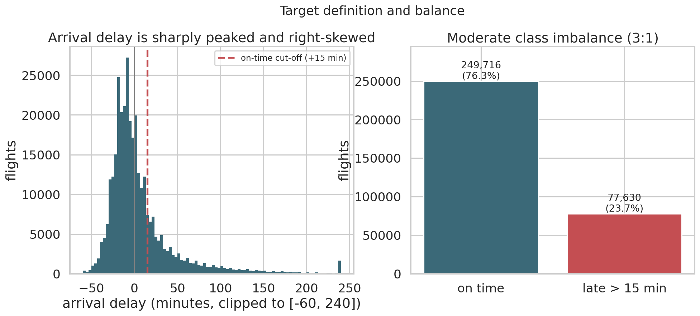

Arrival delay is sharply peaked and heavily right-skewed. The median flight
arrives **5 minutes early**; the 90th percentile is **+52 minutes** and the
99th is **+190 minutes**. Because the distribution has so much mass just below
the threshold, the 15-minute cutoff sits on a steep part of the curve — small
shifts in conditions move a lot of flights across the line, which is precisely
why the problem is learnable at all.

Class balance is a manageable 3:1. That is imbalanced enough that ROC-AUC
flatters the model and accuracy is meaningless (a model predicting "on time"
for everything scores 76%), so **PR-AUC is the headline metric throughout**.

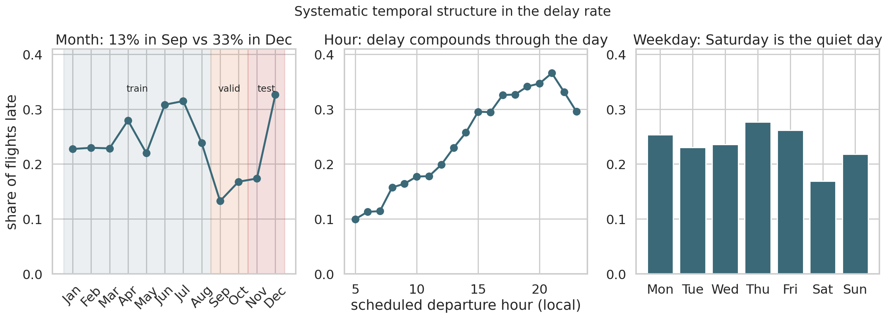

Three temporal structures, all strong:

- **Month.** 13.2% late in September, 32.6% in December — a factor of 2.5. June
  and July are nearly as bad as December, for a different reason
  (thunderstorms rather than winter weather plus holiday load).
- **Hour.** 10% for the 05:00 departure bank, rising monotonically to 37% by
  21:00. This is delay propagation made visible: the network starts each day
  clean and accumulates lateness.
- **Weekday.** Saturday is the quiet day at 17%; Thursday the worst at 27.5%.

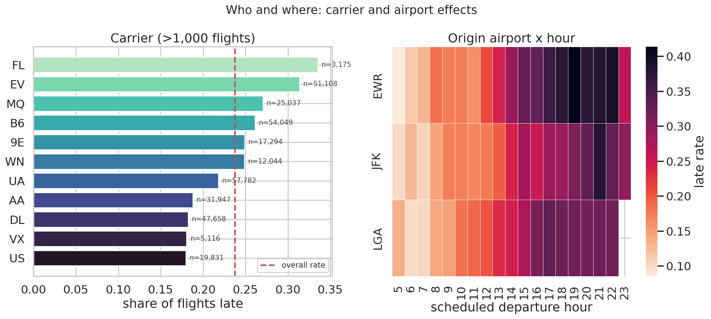

Carrier effects span a factor of three, from Hawaiian at 12.6% to Frontier at
37.3%, though the extremes are thin-volume operators. Among the large carriers
the spread is still wide: Delta 18.2% against ExpressJet 31.4%. Newark is the
worst of the three airports (25.6%) and LaGuardia the best (22.4%), but the
airport effect is small next to the hour-of-day effect.

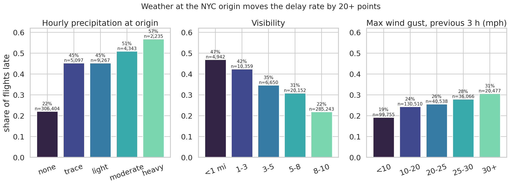

Weather at the origin is the strongest single driver visible in the raw data.
Dry hours run 22.1% late; hours with any precipitation run **47.7%**. Heavy
precipitation reaches 57%. Visibility below 3 miles doubles the rate from 22.9%
to 45.5%. Wind gusts matter but less dramatically — 19% below 10 mph, 31% above
30 mph.

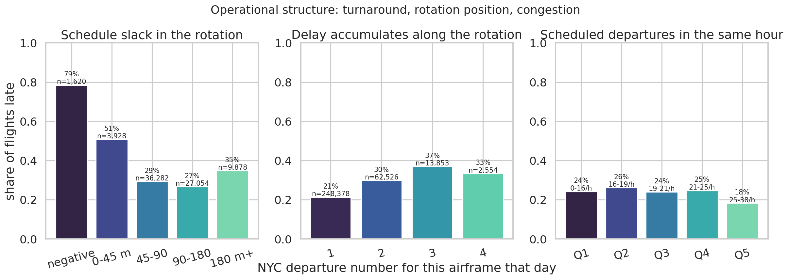

The operational panel is where the feature engineering earns its keep, and it
also contains a mistake we made and corrected — see §3.3.

### 2.2 Data quality issues found and handled

- **Impossible wind speeds.** The ASOS feed contains a 1,048 mph reading and
  several other physically impossible values. Clipped at 60 mph (gusts at 90)
  rather than dropped, so the hour survives for its other variables.
- **Missing wind gusts.** Recorded only when gusting; filled with the sustained
  wind speed, which is the correct physical default.
- **Unmatched weather hours.** 0.47% of flights have no observation at their
  scheduled hour. Filled with the origin-and-month median.
- **Unmatched aircraft.** 16.3% of tail numbers are absent from the FAA
  registry. Left as missing rather than imputed — LightGBM learns a
  missing-value direction natively, and "this airframe is not in the registry"
  is itself weakly informative.
- **A non-unique join key, found late.** The clocks went back on 3 November
  2013, so local hour 01:00 occurs twice at each airport and the weather table
  contains six rows whose `(origin, date, hour)` key is not unique. A left join
  on a non-unique key silently duplicates flights. This is invisible in the
  main model — nothing departs at 01:00 — and only surfaced when the
  forecast-horizon experiment (§5.6) shifted the join backwards in time and
  mapped real departures onto that hour, tripping an assertion on the row
  count. Fixed by keeping the first observation of the repeated hour; two tests
  now guard it. The lesson is that the bug was latent and harmless for months
  of work, and would have stayed latent without an experiment that stressed the
  join in a new direction.
- **Timezone correctness.** Scheduled block time cannot be computed by
  subtracting two clock times, because arrival is in the destination's
  timezone. `tests/test_features.py` verifies that the corrected block time
  exceeds actual air time by a median of 31 minutes (plausible taxi) and that
  JFK–LAX comes out near six hours rather than three or nine.

---

## 3. Feature engineering

67 features in the deployable configuration, in seven families. The organising
question for every one of them was: *does this quantity exist, in this form, at
the scheduled departure time?*

### 3.1 The three kinds of information, and which are legitimate

**Published-schedule facts** are known months ahead and cannot leak. Congestion
counts fall here: how many flights are *scheduled* to leave Newark in this
hour, how many share this 15-minute slot, what share of the slot belongs to
this carrier. We compute these over the whole calendar year, including the test
period, and that is correct — the timetable for December was published in
advance and contains no information about December outcomes.

**Contemporaneous observations** exist at the decision point. Origin weather at
the scheduled hour qualifies, along with rolling 3- and 6-hour precipitation
totals, minimum visibility, maximum gust and pressure tendency, all of which
look strictly backwards.

**Outcome-derived statistics** must be fitted on the training period only.
Eight smoothed historical late rates (by carrier, destination, route, tail
number, origin × hour, carrier × destination, destination × hour, carrier ×
hour) use Bayesian shrinkage toward the global prior with m = 50 pseudo-flights,
so a route flown twenty times does not get a confident rate.

Inside the training period these encodings are computed **out-of-fold** across
five folds. This is not a formality. `tailnum` has roughly 4,000 levels; an
in-fold encoding would let each flight's own label into its own feature and the
model would memorise the training set. The test suite asserts that `te_tailnum`
alone reaches an AUC between 0.50 and 0.62 — a leaked version would approach
1.0.

### 3.2 A target encoding we had to throw away

Our first encoding set included a `destination × month` key. It looked
excellent in training. It is worthless at deployment, and the reason is
structural: with a temporal split, **no test month ever appears in the training
period**, so every test row falls back to the global prior. A feature that is
informative in training and constant in production is not merely useless, it
actively displaces capacity the model could have spent on something that
generalises.

The general rule we adopted: **any encoding key must be recurrent across the
split boundary.** `dest × hour` is fine because December has the same 24 hours
as January. `dest × month` is not. A test in the suite now enforces this by
asserting that fewer than half of test rows fall back to the prior for any
encoding.

### 3.3 Aircraft rotation: a feature we got wrong first

Delay propagation is the dominant mechanism in airline operations — a late
inbound aircraft makes the next departure late — so we wanted a turnaround
feature. The first attempt computed, per tail number, the gap between the
previous leg's scheduled arrival and this departure.

The EDA figure exposed the error immediately: flights with a "turnaround" under
45 minutes were 81% late, but there were only 186 of them, and several had
*negative* turnarounds. The bug is conceptual. **This dataset records only
flights departing NYC.** An aircraft that leaves JFK for Miami must fly back to
New York before it can leave again, and that return leg is invisible. The gap
we measured spans an entire unobserved round trip, so a "45-minute turnaround"
was a data artefact, not a tight turn.

The fix subtracts the previous leg's scheduled block time as an estimate of the
unobserved return, leaving the genuine schedule slack:

```
rotation_slack_min = (sched_dep − prev_sched_arr) − prev_sched_block
```

The corrected feature behaves like a real operational quantity:

| Schedule slack | Late rate | n |
|---|---:|---:|
| negative (impossible timetable) | **79%** | 1,620 |
| 0–45 min | 51% | 3,928 |
| 45–90 min | 29% | 36,282 |
| 90–180 min | 27% | 27,054 |
| 180 min+ | 35% | 9,878 |

Monotone across the operationally meaningful range, with a sensible uptick at
the long tail (very long gaps mean the airframe sat idle through a disrupted
day). We kept the mistake in the report because the diagnosis — *the data
generating process does not contain what I assumed it did* — is the lesson.

The same reasoning constrains the post-push-back mode: the inbound arrival
delay is only used when the previous leg is same-day **and** its actual arrival
preceded our scheduled departure. A test verifies this holds for every flagged
row.

### 3.4 The seven families

| Family | n | Examples |
|---|---:|---|
| Weather | 17 | precipitation and 3/6-hour totals, visibility and 3-hour minimum, wind gust and 3-hour maximum, pressure tendency, temperature, humidity |
| Historical rates | 8 | smoothed out-of-fold late rates by carrier, route, airframe, origin × hour |
| Calendar | 12 | month, day of week, day of year, holiday window, departure hour (raw and cyclical), red-eye flag |
| Route & schedule | 11 | distance, scheduled block time, block time versus route median, implied speed, destination coordinates and elevation |
| Congestion | 7 | departures from the origin in the hour and 15-minute slot, carrier share of the slot, system-wide NYC departures |
| Rotation | 5 | schedule slack, gap since previous NYC leg, tight-turn flag, leg number of the day |
| Aircraft | 6 | age, seats, engines, engine type, manufacturer, airframe class |

---

## 4. Experimental design

### 4.1 The split is temporal, and deliberately unkind

Train **Jan–Aug** (217,727 flights), validate **Sep–Oct** (55,628), test
**Nov–Dec** (53,991). Never random.

A random split would let the model see flights that happen *after* the ones it
is scored on, and with congestion and weather shared across flights in the same
hour, neighbouring rows are close to duplicates. Random-split scores on this
dataset are inflated and not comparable to ours.

The temporal split is uncomfortable by construction, and we chose it anyway:

| Period | Late rate |
|---|---|
| Train (Jan–Aug) | 25.6% |
| Validation (Sep–Oct) | **15.1%** |
| Test (Nov–Dec) | **25.0%** |

Validation sits at a base rate ten points below both neighbours, because
September and October 2013 were unusually smooth. This is exactly the situation
a deployed model faces — you tune on the recent past and deploy into a future
that does not resemble it — and it produces the most interesting result in the
study (§6).

### 4.2 Hyperparameter search

40 random draws over nine LightGBM hyperparameters, each scored by PR-AUC on a
**forward-chaining three-fold time-series split inside the training period**:
fold *k* trains on the earliest months and scores the block that follows, never
the reverse. Early stopping at 100 rounds within each fold.

Random search rather than grid: with nine interacting dimensions, a grid of 40
points would pin each dimension to one or two values, whereas 40 random draws
give 40 distinct values per dimension.

The validation block was deliberately excluded from the search and reserved for
early stopping, calibration and threshold selection, so that **the test set was
scored exactly once, at the end**.

Search spread was narrow — best 0.5376, median 0.5328, worst 0.5258 across 40
draws. The problem is not hyperparameter-sensitive, which is itself worth
knowing: effort spent on features paid far better than effort spent on tuning.

Selected configuration:

```
num_leaves 191 · max_depth 8 · learning_rate 0.02 · min_child_samples 100
feature_fraction 0.7 · bagging_fraction 0.9 · lambda_l1 5.0 · lambda_l2 2.0
min_split_gain 0.05 · 391 trees at early stopping
```

Fold scores 0.490 / 0.560 / 0.563 — the first fold is meaningfully harder,
reflecting how much less history it trains on.

### 4.3 Baselines

Four, each answering a different objection:

1. **Base rate** — predicts the training prior for everything. ROC-AUC 0.500 by
   construction; the floor.
2. **Historical-rate rule** — what an operations analyst writes without machine
   learning: look up how often this carrier flew this route at this hour and
   was late. Built from the same smoothed encodings the model gets, so it is a
   fair comparison rather than a strawman.
3. **Logistic regression** — median imputation, standardisation, one-hot with
   rare levels pooled. Tests whether the problem needs non-linearity.
4. **Random forest** — capped at 150 trees, depth 14. Tests whether it needs
   *boosting* specifically.

---

## 5. Results

All numbers on the untouched Nov–Dec test period: 53,991 flights, 25.0% late.

| Model | PR-AUC | ROC-AUC | Brier | Log loss |
|---|---:|---:|---:|---:|
| Base rate | 0.250 | 0.500 | 0.188 | 0.562 |
| Historical-rate rule | 0.340 | 0.621 | 0.182 | 0.547 |
| Logistic regression | 0.478 | 0.708 | 0.166 | 0.509 |
| Random forest | 0.491 | 0.713 | **0.164** | **0.504** |
| LightGBM (tuned) | 0.507 | 0.716 | 0.167 | 0.519 |
| **XGBoost (tuned)** | **0.513** | **0.719** | 0.168 | 0.518 |
| *LightGBM, post-push-back* | *0.846* | *0.903* | *0.097* | *0.327* |

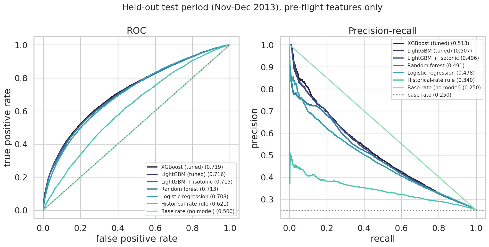

Reading these honestly:

- The tuned model doubles PR-AUC over the base rate (0.507 against 0.250) and
  beats the no-machine-learning rule by half again (0.340).
- **The gain from gradient boosting over logistic regression is 0.029 PR-AUC.**
  Real, but small next to the 0.138 that logistic regression itself gains over
  the historical-rate rule. Most of the value came from constructing the
  features, not from the model class.
- **XGBoost edges LightGBM, and the first version of this comparison was
  unfair.** Initially XGBoost got 8 search draws to LightGBM's 40, and its
  categorical features were one-hot expanded while LightGBM used native
  categorical splits. On that footing the two looked identical (0.508 vs
  0.507). Rerun with 40 draws over a matched nine-dimensional space,
  `grow_policy="lossguide"` so both grow leaf-wise, and `enable_categorical`
  so both see the same representation, XGBoost is ahead on cross-validation at
  every percentile (median draw 0.5371 against 0.5328) and on the test set
  (0.513 against 0.507). The gap is small, but the lesson is not: **a
  library comparison is mostly a comparison of the search budget and the
  feature representation each library was given.** Ours was accidentally
  rigged, and it took deliberately re-levelling it to notice.
- Random forest has the best Brier score and log loss despite worse ranking,
  because averaging bootstrap votes produces conservative, well-spread
  probabilities. Discrimination and calibration are separate properties, and
  §6 makes that separation the point.

### 5.1 The prediction-horizon experiment

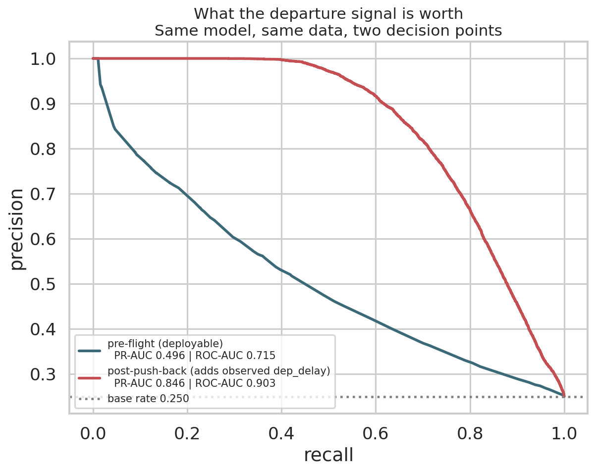

Same model, same features, same split — the only change is admitting
`dep_delay` and the inbound leg's actual delay. PR-AUC goes from 0.507 to
0.846; ROC-AUC from 0.716 to 0.903.

The interpretation is not that our model is weak. It is that **arrival delay is
mostly departure delay plus noise**, and departure delay is not knowable in
advance. Any published result in the 0.90 ROC-AUC range on this dataset is
answering the post-push-back question. The two numbers are not comparable and
should never be quoted side by side without the horizon attached.

### 5.2 Turning probabilities into decisions

A probability is not a decision. We define an explicit cost model: a false
alarm wastes agent time and erodes trust; a missed delay causes misconnections,
rebooking and compensation. We set the missed-delay cost at **4× the false
alarm** — a policy choice, stated openly and swept rather than hidden.

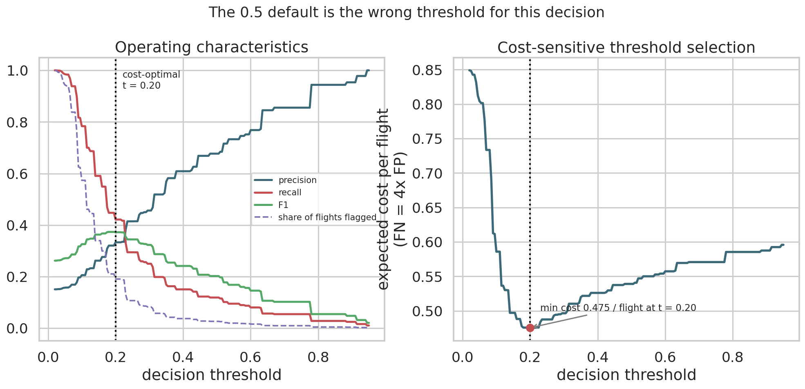

Minimising expected cost on the validation period gives a threshold of
**0.20**, not 0.5. On the test period that yields:

| | |
|---|---|
| Precision | 47.3% |
| Recall | 49.2% |
| F1 | 0.482 |
| Share of flights flagged | 26.0% |
| Expected cost per flight | **0.645** |

Against the alternatives: alerting on nothing costs 1.000 per flight and
alerting on *everything* costs 0.750. The cost-optimal threshold beats the
better of those by 14%. The default 0.5 threshold costs **0.844** — 31% worse
than the tuned threshold, and worse than the trivial policy of alerting on
every single flight. **A well-fitted model deployed at the default threshold
would have been actively counter-productive here.** Choosing the threshold by
cost rather than convention is the difference between a model that helps and
one that does not.

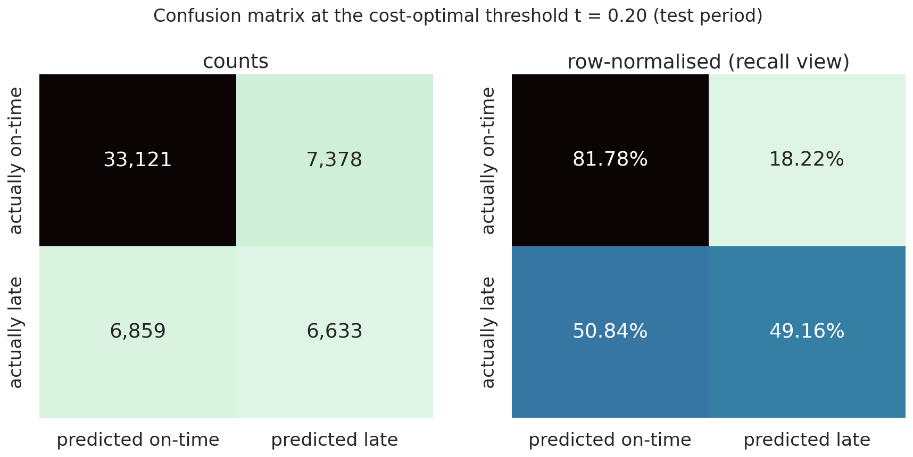

### 5.3 The operational view

A desk cannot act on 26% of flights. Fixing the alerting budget at the top 10%
by predicted risk:

| | |
|---|---|
| Flights flagged | 5,399 |
| Of which actually late | **64.1%** |
| Share of all late flights caught | 25.7% |
| Lift over base rate | **2.56×** |

Two out of every three flights the model puts at the top of the list do arrive
late, against a background rate of one in four. For a triage tool this is the
number that matters, and it is considerably more encouraging than ROC-AUC 0.716
sounds.

### 5.4 Severity: how late, not just whether late

A second LightGBM regressor predicts arrival delay in minutes, trained with an
L1 objective because the right tail would otherwise dominate a squared-error
fit.

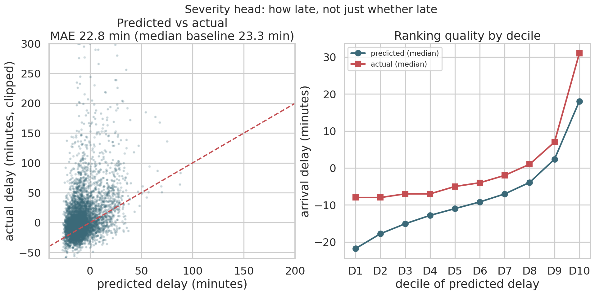

The honest summary is mixed, and the two halves point in opposite directions:

- **Point accuracy is barely better than a constant.** MAE 22.8 minutes against
  23.3 for always predicting the training median — a 2.2% improvement. Three
  quarters of flights are on time and L1 loss rewards predicting the median, so
  it does.
- **Ranking is genuinely useful.** Spearman ρ = 0.332, and the decile medians
  rise monotonically from −8 minutes in the lowest decile to **+31 minutes in
  the highest**, where 64% of flights are late. On late flights specifically,
  MAE improves from 60.4 to 57.0 minutes.

So the severity head should be presented as a *sorting* tool, not a
*forecasting* tool. "This flight is in the worst decile, where the typical
delay is half an hour" is supportable. "This flight will be 31 minutes late" is
not.

That verdict was weak enough to be worth a second attempt, and the second
attempt is in §5.6.

### 5.5 Severity, reframed: tiers and quantiles

The conditional-mean regressor answers a question nobody asks — "what is the
expected delay of a randomly chosen flight" — and L1 loss on a distribution
that is 76% on-time is minimised by predicting the median, so it does. Three
replacements, each matched to a decision that gets made.

**Severity tiers.** Separate classifiers for delay > 15, > 60 and > 120
minutes. The thresholds are operationally distinct: 15 minutes is the on-time
metric, 60 breaks most connections, 120 enters compensation territory.

| Tier | Base rate | PR-AUC | ROC-AUC | Precision in riskiest 10% | Lift |
|---|---:|---:|---:|---:|---:|
| > 15 min | 25.0% | 0.505 | 0.716 | 63.7% | 2.55× |
| > 60 min | 7.4% | 0.293 | 0.770 | 30.5% | **4.10×** |
| > 120 min | 2.3% | 0.168 | **0.793** | 11.9% | **5.14×** |

**Severe delays are more predictable than marginal ones**, not less. ROC-AUC
rises from 0.716 to 0.793 as the tier gets rarer, and lift more than doubles.
That is the opposite of the usual rare-event story, and it makes sense
mechanically: a two-hour delay needs a real cause — a storm, a closed runway, a
badly broken rotation — and those causes are in the feature set. A 20-minute
delay is mostly noise. The model is best exactly where the consequences are
worst.

**Quantile heads.** Quantile regression at the 50th and 90th percentiles,
scored with pinball loss against a constant-quantile baseline.

| Head | Pinball | Constant baseline | Improvement | Coverage (target) |
|---|---:|---:|---:|---:|
| P50 | 11.395 | 11.631 | 2.0% | 0.343 (0.50) |
| P90 | 7.757 | 9.281 | **16.4%** | 0.860 (0.90) |

Same split as the tiers: the **upper tail is predictable and the centre is
not**. The P90 head is 16.4% better than a constant, the P50 head is 2.0%
better, i.e. nothing. Both under-cover on the test period (0.860 against a 0.90
target) for the same December reason as §6 — the quantile heads inherit the
level shift, and would need the same rolling correction.

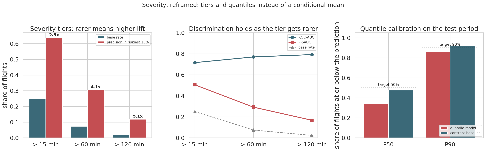

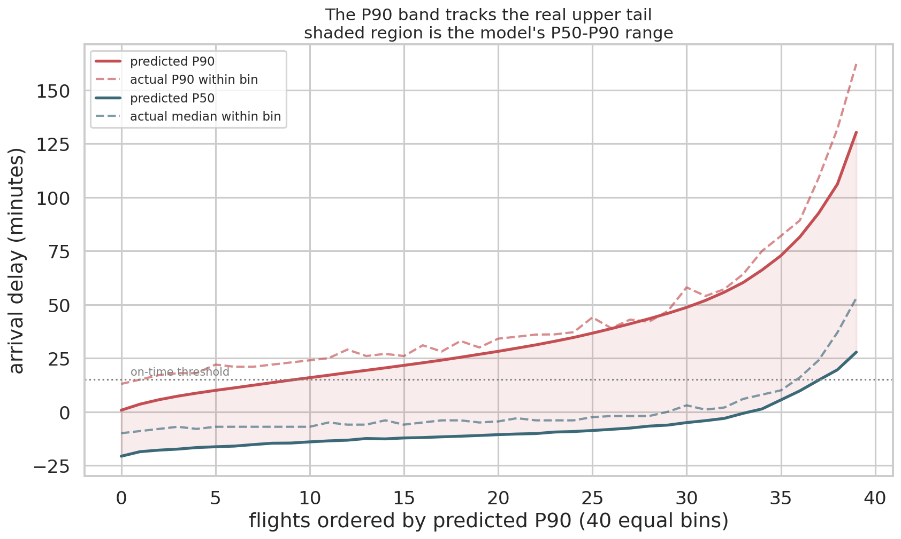

**Conditional on lateness.** Trained only on flights that did arrive late, MAE
improves from 32.1 to 29.5 minutes, a 7.9% gain — three and a half times the
2.2% the unconditional model managed, because the target no longer has a
76%-on-time spike at its centre.

The reframing is the finding: the same features that barely support a
conditional mean comfortably support a tail estimate and a tier classifier.
Choosing the wrong output format made a usable model look useless.

### 5.6 How far ahead can this actually be predicted?

The model uses the weather observation at the scheduled departure hour. That is
legitimate at a zero-hour horizon, but the ablation (§7.1) showed weather
carries 0.141 of the 0.507, so "you would need a forecast to go further ahead"
cannot be left as an unquantified caveat.

For a horizon of *h* hours each flight was given the observation from *h* hours
before its scheduled departure, and the model retrained from scratch. That is a
**persistence forecast** — the crudest one possible, "conditions will be what
they are now". Real numerical weather prediction beats persistence at every
horizon past an hour or two, so this curve is a **lower bound** on what a
forecast-fed model would achieve.

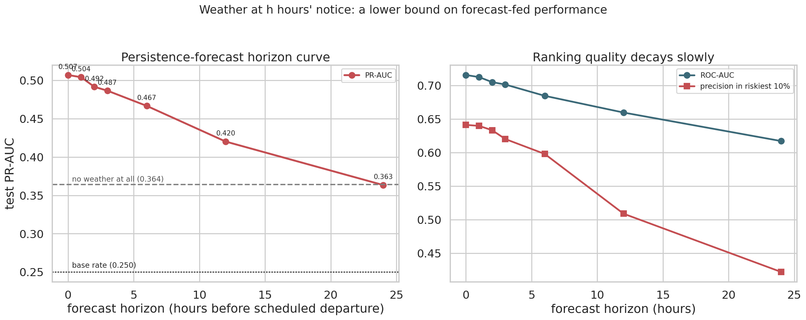

| Horizon | PR-AUC | ROC-AUC | Precision in riskiest 10% | Share of weather's contribution retained |
|---|---:|---:|---:|---:|
| 0 h | 0.507 | 0.716 | 64.1% | 100% |
| 1 h | 0.504 | 0.713 | 64.0% | 98% |
| 2 h | 0.492 | 0.705 | 63.3% | 89% |
| 3 h | 0.487 | 0.701 | 62.0% | **86%** |
| 6 h | 0.467 | 0.685 | 59.8% | **72%** |
| 12 h | 0.420 | 0.660 | 50.9% | 39% |
| 24 h | 0.363 | 0.617 | 42.2% | **0%** |

Three things to take from it:

1. **A three-hour planning horizon costs almost nothing** — 0.020 PR-AUC, 86%
   of weather's contribution retained, and that is with the worst possible
   forecast. Six hours still retains 72%. The system is deployable well before
   push-back, which was the open question.
2. **Twenty-four hours is worthless, exactly.** The h=24 model scores 0.3634;
   the model trained with no weather at all scores 0.3640. Yesterday's weather
   at this hour carries no usable information about today's. That the curve
   lands precisely on the no-weather floor is a built-in sanity check that the
   experiment measures what it claims to.
3. **Ranking decays more slowly than calibration-sensitive metrics.** Precision
   in the riskiest 10% holds above 60% out to three hours. Even at 12 hours the
   top decile is half late, against a 25% base rate.

### 5.7 Recovering the flights that were thrown away

§2 dropped 9,430 cancelled and diverted flights because they have no arrival
delay, and flagged it as a limitation. It is the worst kind of limitation:
cancellation is the most disruptive outcome for a passenger, and cancellations
are not randomly distributed — 5.1% of February departures against 0.8% in
October. Dropping them makes the year look calmer than it was, precisely in the
weeks the model exists to warn about.

So keep all 336,776 flights and model three outcomes on the identical
pre-flight feature set. `is_cancelled` (never left: no departure time, no
arrival time), `is_diverted` (left, arrived somewhere else), and `is_disrupted`
(any of cancelled, diverted, or more than 15 minutes late). Target encodings
were refitted against each target — a carrier's historical *late* rate says
little about its *cancellation* rate.

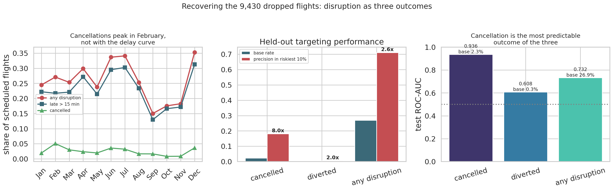

| Target | Base rate | PR-AUC | ROC-AUC | Precision in riskiest 10% | Lift | Recall at 10% |
|---|---:|---:|---:|---:|---:|---:|
| Cancelled | 2.3% | 0.552 | **0.936** | 18.2% | **8.00×** | **80.0%** |
| Diverted | 0.3% | 0.006 | 0.608 | 0.6% | 2.01× | 20.1% |
| Any disruption | 26.9% | 0.566 | 0.732 | 71.1% | 2.64× | 26.4% |

The result inverts the limitation. **The rows we threw away were the most
predictable part of the problem.** Cancellation reaches ROC-AUC 0.936 — far
above the 0.716 of the late/on-time task — and ranking flights by cancellation
risk puts **80% of all December cancellations in the top 10% of the list**. The
mechanism is the same one that makes severe delays predictable: a cancellation
needs a real cause, and 8.3% of flights scheduled into a precipitating hour
were cancelled against 2.0% in dry hours.

Diversions are the honest negative result: PR-AUC 0.006 against a 0.003 base
rate, ROC-AUC 0.608. Barely better than chance, and it should be. A diversion
is decided in the air by conditions at the *destination*, and this dataset
contains weather for the three NYC origins only. There is nothing in the
feature set that could predict it.

The combined disruption model is the one to deploy: PR-AUC 0.566 and 71.1%
precision in the riskiest decile, both better than the late-only model, because
the added outcome is the easy one.

### 5.5 Where the model fails

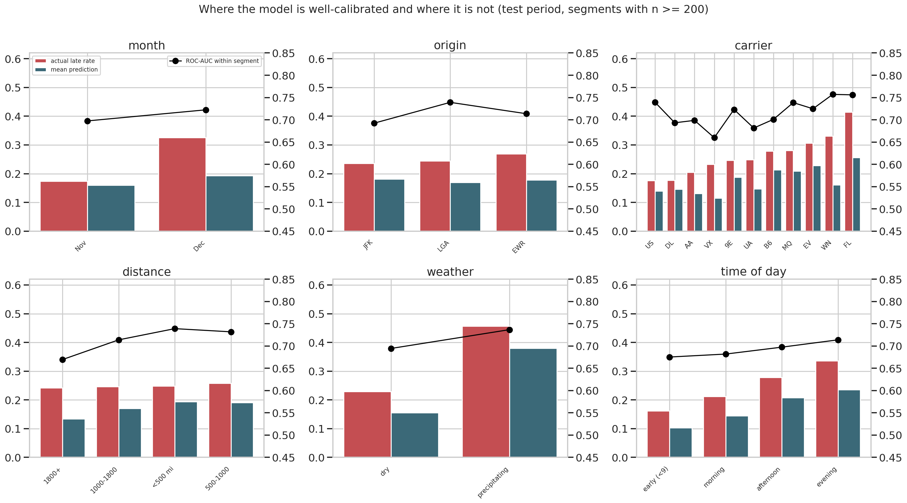

Broken out by month, origin, carrier, distance, weather and time of day
(segments with n ≥ 200):

- **Discrimination is stable.** Within-segment ROC-AUC stays between 0.66 and
  0.76 everywhere. No segment is being served by noise.
- **Calibration is not.** Every segment under-predicts, and November
  (predicted 16.0% against 17.4% actual) is close while December
  (predicted 19.3% against 32.6% actual) is badly off. The failure is a
  systematic level shift concentrated in one month, not scattered error.
- **Long-haul is hardest.** Flights over 1,800 miles score ROC-AUC 0.670
  against 0.739 for flights under 500 miles. Long flights have more time to absorb or
  accumulate en-route disruption that no NYC-origin feature can see.
- **Weather segments behave sensibly.** Precipitating hours score *higher*
  within-segment AUC (0.737) than dry hours (0.695) — when weather is doing the
  work, the model has something to work with.

---

## 6. Calibration under distribution shift

This section is the analytical core of the report.

The model's average prediction on the test period is **0.175** against an
actual rate of **0.250**. It is systematically under-confident. But the failure
is not uniform:

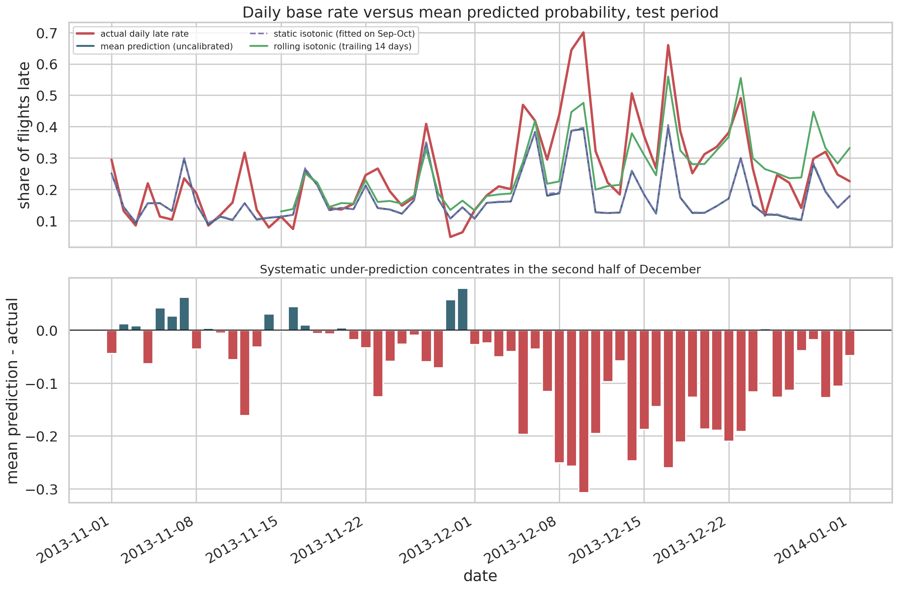

Through November the daily mean prediction tracks the daily actual rate
closely, including the sharp spikes. From roughly 8 December the two diverge and
never reconverge: on the worst days the model predicts 0.40 while 0.70 of
flights arrive late.

### 6.1 Why — a diagnosis, not a guess

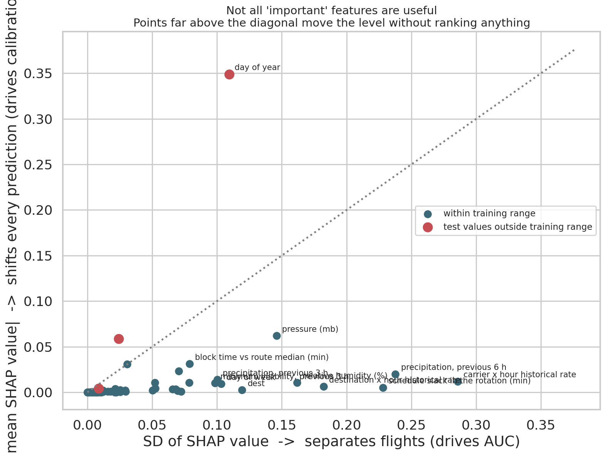

SHAP ranks `day_of_year` as the **single most influential feature** by mean
|SHAP|, ahead of every weather and historical-rate variable. That is
suspicious, and inspecting it explains the drift:

- Training values span days **1–243**. Test values span **305–365**. Every test
  flight is outside the range the model ever saw.
- A gradient-boosted tree cannot extrapolate. Every test flight falls into the
  same terminal bin on every split involving this feature.
- The result is a near-constant contribution of **−0.349 log-odds**, with
  standard deviation only 0.109 — Nov −0.360, Dec −0.339, essentially flat.
- The total mean SHAP across all features is −0.508, so **`day_of_year` alone
  accounts for 69% of the model's average downward push**.

The scatter plot above generalises this. Plotting |mean SHAP| against SD of
SHAP separates two behaviours that the standard importance bar chart adds
together:

- Points far **above** the diagonal shift every prediction by the same amount.
  They move calibration and contribute nothing to ranking. `day_of_year` is the
  extreme case, and all three flagged out-of-range features (`day_of_year`,
  `week_of_year`, `month`) sit there.
- Points **along or below** the diagonal vary flight to flight. They are what
  produce AUC. `te_carrier_sched_dep_hour` (SD 0.286) and `wx_precip_6h`
  (SD 0.236) are the real discriminators.

**Mean |SHAP| conflates the two, and on a temporal split it will reliably
promote calendar indices to the top of the chart while they are contributing
nothing to discrimination.** We have not seen this stated in the standard SHAP
guidance and consider it the most transferable finding here.

### 6.2 The obvious fix does not work

Delete the offending features? We tested it. Removing `day_of_year`,
`week_of_year` and `month` **costs 0.016 PR-AUC** (0.505 → 0.489). They earn
their place through interactions with other features even though their direct
contribution is a constant offset. Removing them is a net loss.

Calibrate once on the validation period? Isotonic regression fitted on Sep–Oct
changes the test Brier score from 0.18006 to 0.18003 — nothing. It cannot help,
because it was fitted where the base rate is 15% and applied where it is 25%,
so it corrects in the wrong direction.

### 6.3 What does work

Recalibrate continuously. Each day, refit an isotonic map on the previous 14
days of flights that have already landed — labels a deployed system genuinely
has — and use it to score today. Every day is scored by a calibrator that has
never seen it.

| Method | Brier | Log loss | Mean prediction |
|---|---:|---:|---:|
| Uncalibrated | 0.1801 | 0.5526 | 0.183 |
| Isotonic, fitted on validation | 0.1800 | 0.5518 | 0.185 |
| **Isotonic, rolling 14 days** | **0.1698** | **0.5209** | **0.259** |
| *(actual rate)* | | | *0.276* |

A **5.7% reduction in both Brier score and log loss**, and the mean prediction
moves from 0.183 to 0.259 against an actual 0.276. The green line in the drift
figure tracks December where the blue and purple lines flatten.

The operational conclusion: **for this problem, the maintenance burden is
recalibration, not retraining.** Retraining is expensive and needs a full
season of new labels; rolling recalibration needs two weeks of outcomes and a
few milliseconds of isotonic regression. The discriminative structure the model
learned in January still holds in December — only the level moved.

---

## 7. What the model actually uses

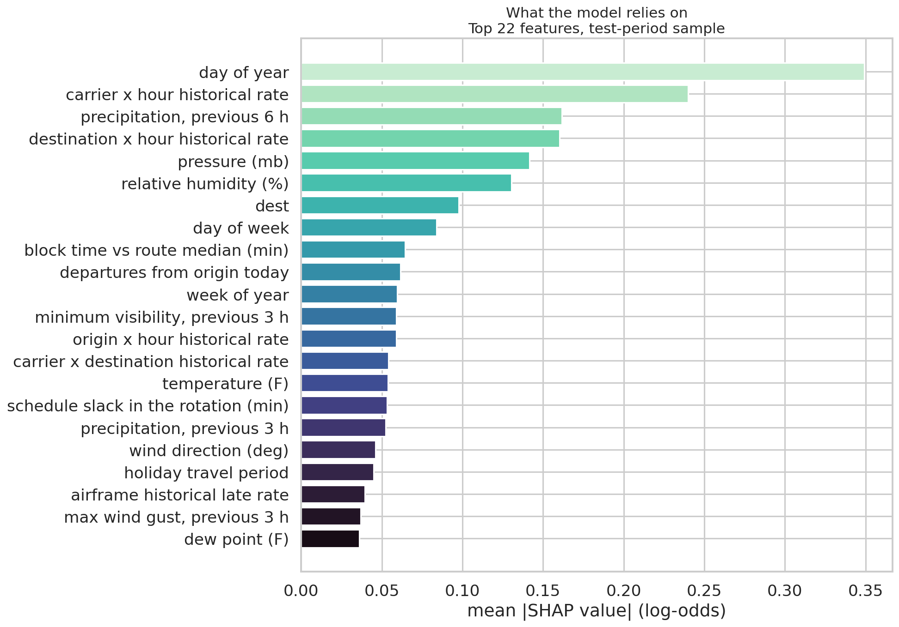
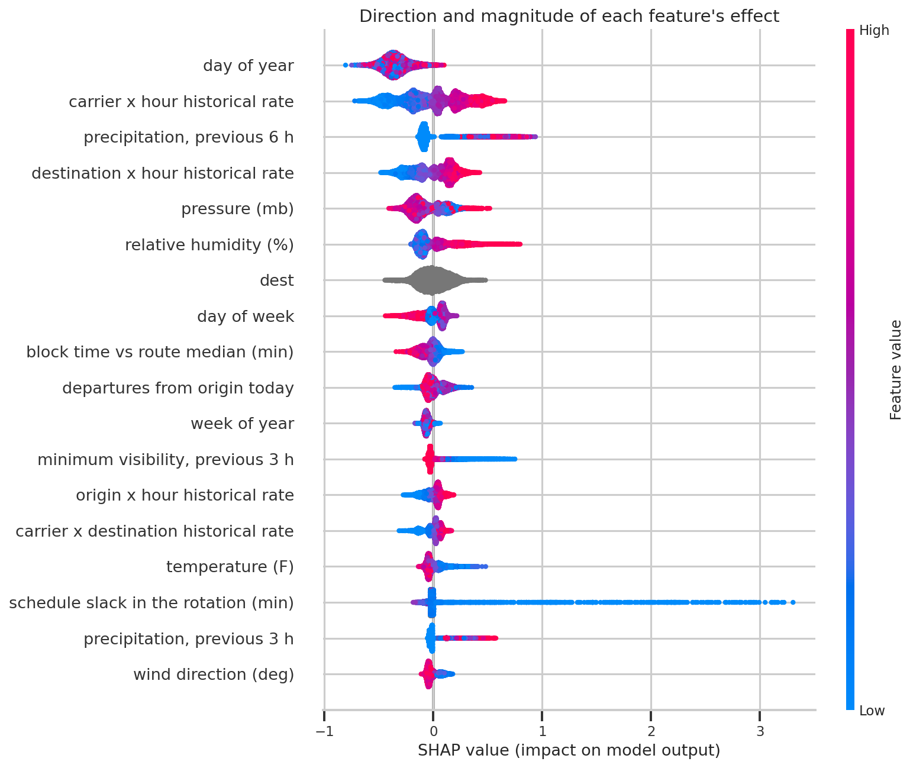

Setting aside `day_of_year` (§6.1), the top features are the carrier × hour
historical rate, 6-hour precipitation, the destination × hour rate, pressure
and humidity. The beeswarm confirms the directions are physically sensible:
high precipitation pushes towards late, high pressure (fair weather) pushes
towards on-time, high historical rates push towards late.

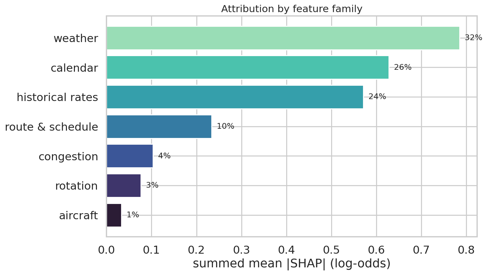

By family, attribution splits weather 32%, calendar 26%, historical rates 24%,
route and schedule 10%, congestion 4%, rotation 3%, aircraft 1%.

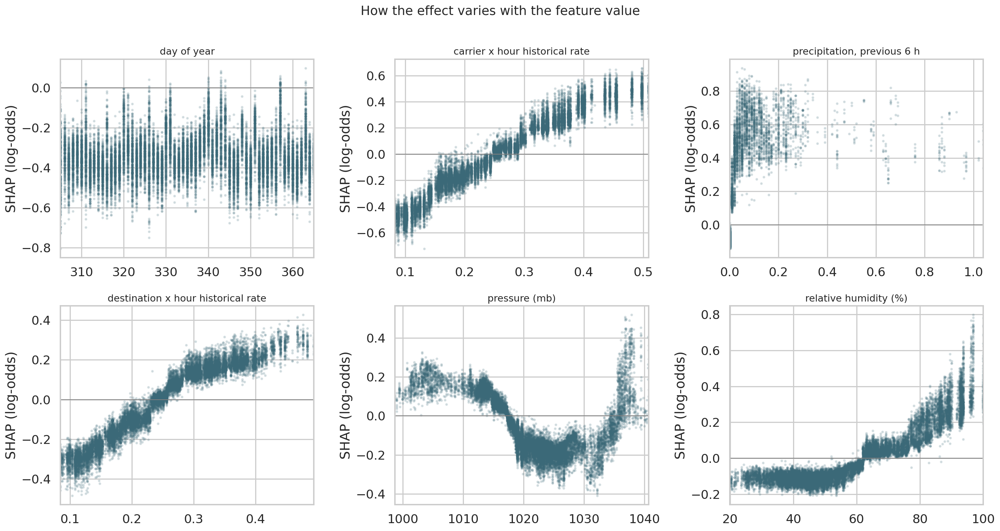

The dependence plots show threshold behaviour rather than linear response.
Precipitation has almost no effect until it becomes non-zero, then jumps.
Visibility matters below about 5 miles and is flat above it. This is why tree
ensembles beat logistic regression here, and also why the margin is only 0.029
— the thresholds are sharp but few.

### 7.1 Attribution is not value: the ablation

SHAP measures how much the *fitted model leans on* a feature. That is not the
same as how much predictive value the feature *carries*, because a feature can
be heavily used and entirely redundant. To measure value we retrained the model
with each family removed and recorded the drop in test PR-AUC.

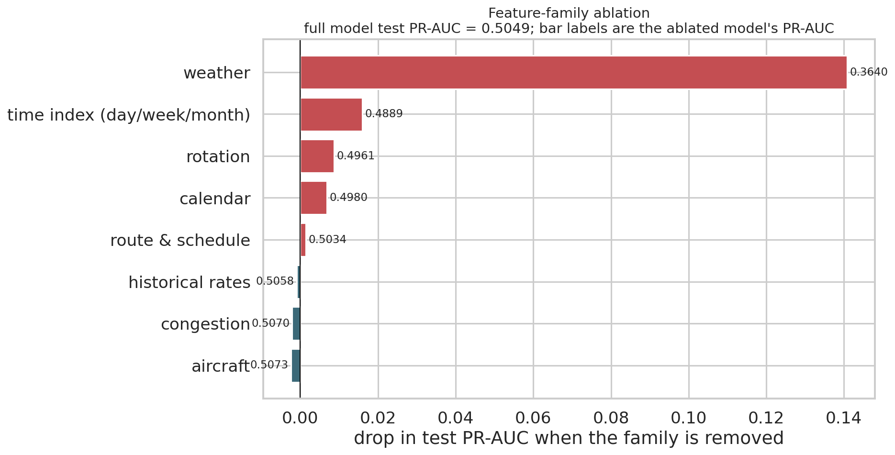

| Family removed | Test PR-AUC | Change |
|---|---:|---:|
| — (full model) | 0.5049 | — |
| **Weather** | 0.3640 | **−0.1409** |
| Time index (day/week/month) | 0.4889 | −0.0160 |
| Rotation | 0.4961 | −0.0088 |
| Calendar (all) | 0.4980 | −0.0069 |
| Route & schedule | 0.5034 | −0.0015 |
| Historical rates | 0.5058 | **+0.0009** |
| Congestion | 0.5070 | **+0.0021** |
| Aircraft | 0.5073 | **+0.0024** |

Three conclusions, two of them uncomfortable:

1. **Weather is the entire game.** Removing it costs 0.141 PR-AUC — ten times
   the next-largest effect, and it drops the model below logistic regression
   *with* weather. If this system were being productionised, the hourly weather
   feed is the one input worth paying for, and a weather **forecast** feed
   would be the highest-value extension.
2. **The historical-rate encodings are redundant.** Eight target encodings,
   five-fold out-of-fold machinery, Bayesian smoothing — and removing them all
   *improves* test PR-AUC by 0.0009. SHAP attributes 24% of influence to them,
   yet whatever they encode is already recoverable from carrier, destination
   and hour as raw features. This is exactly the attribution-versus-value gap.
3. **Congestion and aircraft features are noise.** Both marginally negative.
   Scheduled congestion is presumably already implicit in hour-of-day, and
   aircraft age tells you about the airline's fleet, not about today.

A leaner model — weather, calendar, route, carrier, rotation — would score
within noise of the full one at roughly a third of the features. We report the
full model because it is what the search selected, but the ablation is the more
useful result for anyone building on this.

### 7.2 Individual explanations

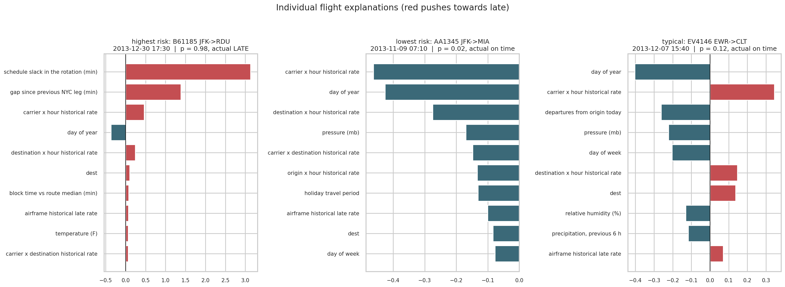

Because SHAP decomposes each prediction exactly, every score comes with a
reason an operations agent can read. The highest-risk flight in the test sample
— B6 1185, JFK→RDU, 30 December at 17:30, p = 0.98, which did arrive late —
is driven almost entirely by rotation slack (+3.1 log-odds): the timetable gave
that airframe an impossible turnaround on one of the worst days of the year.
The lowest-risk flight, AA 1345 JFK→MIA at 07:10 on 9 November, is pushed down
by the carrier × hour rate and the early departure slot.

---

## 8. Limitations

Stated plainly, because most of them bound the result.

Three of the limitations in the first version of this report have since been
measured rather than asserted, and are recorded here as resolved:

- ~~Cancellations and diversions are dropped.~~ **Resolved in §5.7.** All
  336,776 flights are now modelled as three outcomes. Cancellation turned out
  to be the most predictable outcome in the study (ROC-AUC 0.936). Diversion
  remains genuinely unpredictable from NYC-origin features, which is itself the
  answer.
- ~~Weather is observed, not forecast, and we have not measured the cost.~~
  **Resolved in §5.6.** A persistence-forecast horizon curve puts a lower bound
  on it: three hours costs 0.020 PR-AUC, six hours retains 72% of weather's
  contribution, twenty-four hours retains none.
- ~~The severity head barely beats a constant.~~ **Resolved in §5.5.**
  Reframed as tiers and quantiles, where the same features support ROC-AUC
  0.793 on the >120-minute tier and a P90 head 16.4% better than a constant.

What remains:

1. **Diversions are not predictable here** (§5.7), and no amount of feature
   work on NYC-origin data will change that. It needs destination weather and
   en-route conditions.
2. **The horizon curve is persistence, not forecast.** It bounds the answer
   from below, which is the safe direction, but a real NWP forecast feed would
   land somewhere above the curve and we cannot say where without one.
3. **The inbound leg is invisible.** Only NYC departures are recorded, so the
   dominant propagation mechanism is only partly observable (§3.3). A full BTS
   extract with all US flights would let the true inbound aircraft be tracked
   and is the single most promising data extension.
4. **One year, three airports.** No evidence the model transfers to other
   airports or years. 2013 predates several changes in FAA slot rules and
   airline scheduling practice.
5. **Calibration degrades under seasonal shift** and requires rolling
   recalibration (§6). A deployment without it will systematically under-warn
   in the worst weeks — precisely when it matters most.
6. **The 4:1 cost ratio is asserted, not derived.** The threshold moves with
   it. We swept the trade-off (figure 10) so a different ratio can be read off,
   but a real deployment needs the airline's actual numbers.
7. **Congestion counts use the full-year timetable.** Legitimate, since the
   schedule is published in advance — but a strict production replay would
   freeze the timetable as known at prediction time, which differs slightly
   after cancellations.

---

## 9. Conclusions

**On the problem.** Arrival delay is predictable in advance to a useful but
bounded degree: PR-AUC 0.507 against a 0.250 base rate, with 64% precision on
the riskiest 10% of flights. That is a genuine triage tool and not a crystal
ball. The much higher numbers commonly reported for this dataset come from
including the observed departure delay, which lifts PR-AUC to 0.846 and
answers a question nobody needs answered.

**On what matters.** Weather dominates everything else by an order of
magnitude. Feature construction beat model selection: logistic regression on
good features beat the historical-rate rule by 0.138 PR-AUC, while gradient
boosting on those same features beat logistic regression by only 0.029. Two
independently tuned boosting libraries landed within 0.002 PR-AUC of each
other, which
suggests the ceiling here is the data, not the algorithm.

**On method.** Three of our findings are about method rather than flights, and
they are the ones most likely to transfer:

- A target-encoding key that does not recur across a temporal split is worse
  than no feature at all (§3.2).
- Mean |SHAP| conflates level shifts with ranking power, and on temporal splits
  it will promote out-of-range calendar features to the top of the importance
  chart while they contribute nothing to AUC. Plotting mean against standard
  deviation separates them (§6.1).
- Feature attribution and feature value diverge sharply. The historical-rate
  encodings took 24% of SHAP attribution and were worth −0.0009 PR-AUC (§7.1).
  Only an ablation answers the question "is this data worth collecting".

**On deployment.** Ship the pre-flight model with a cost-derived threshold of
0.20 rather than 0.5 — at the default the model costs 31% more per flight than
at the tuned threshold, and more than alerting on every flight — and a rolling
14-day isotonic recalibration, which recovers 5.7% of
Brier score under the December shift that retraining alone would not catch.

---

## Appendix A — Reproducing this report

```bash
pip install -r requirements.txt
make reproduce      # ~15 minutes on 4 cores
```

Every figure and every number above is regenerated by that command. Seeds are
fixed (`SEED = 42` in `src/config.py`); random search draws are seeded, so draw
*i* is always the same hyperparameter set.

## Appendix B — Artefacts

| File | Contents |
|---|---|
| `reports/metrics/evaluation.json` | every test metric, threshold sweep, calibration comparison |
| `reports/metrics/horizon.json` | forecast-horizon curve, 7 horizons |
| `reports/metrics/disruption.json` | cancellation / diversion / disruption models |
| `reports/metrics/severity_v2.json` | tiers, quantile heads, conditional-on-late |
| `reports/metrics/model_fingerprints.json` | booster SHA-256 checksums |
| `reports/metrics/lgbm_search.json` | all 40 search draws with per-fold scores |
| `reports/metrics/xgb_search.json` | 8 XGBoost draws |
| `reports/metrics/ablation.json` | feature-family ablation |
| `reports/metrics/shap_importance.json` | SHAP importance, group shares, out-of-range diagnostics |
| `reports/metrics/segment_errors.csv` | per-segment error analysis |
| `reports/metrics/threshold_sweep_validation.csv` | full precision/recall/cost curve |
| `reports/metrics/eda_summary.json` | descriptive statistics |
| `reports/figures/01–26` | all figures |

## Appendix C — Test suite

16 checks in `tests/test_features.py`, run with `make test`:

*Leakage* — pre-flight features exclude all outcome columns; gate mode adds
exactly the three post-push-back features; the inbound-leg delay never reads
from the future; the tail-number encoding is genuinely out-of-fold; every
encoding key recurs across the split boundary.

*Split integrity* — splits are disjoint, ordered in time, and no rows are lost
across the joins.

*Feature correctness* — timezone-corrected block time matches air time plus
plausible taxi and JFK–LAX comes out near six hours; HH:MM conversion;
congestion counts nest correctly; rotation gaps are non-negative and same-day;
the target matches its definition; the weather join is complete after filling;
the weather join key is unique (the DST trap of §2.2); every forecast horizon
joins one-to-one; no object dtypes reach the model.
